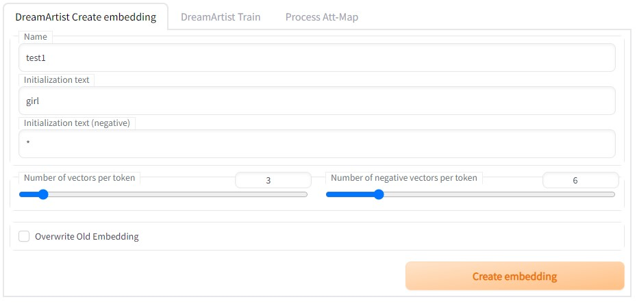
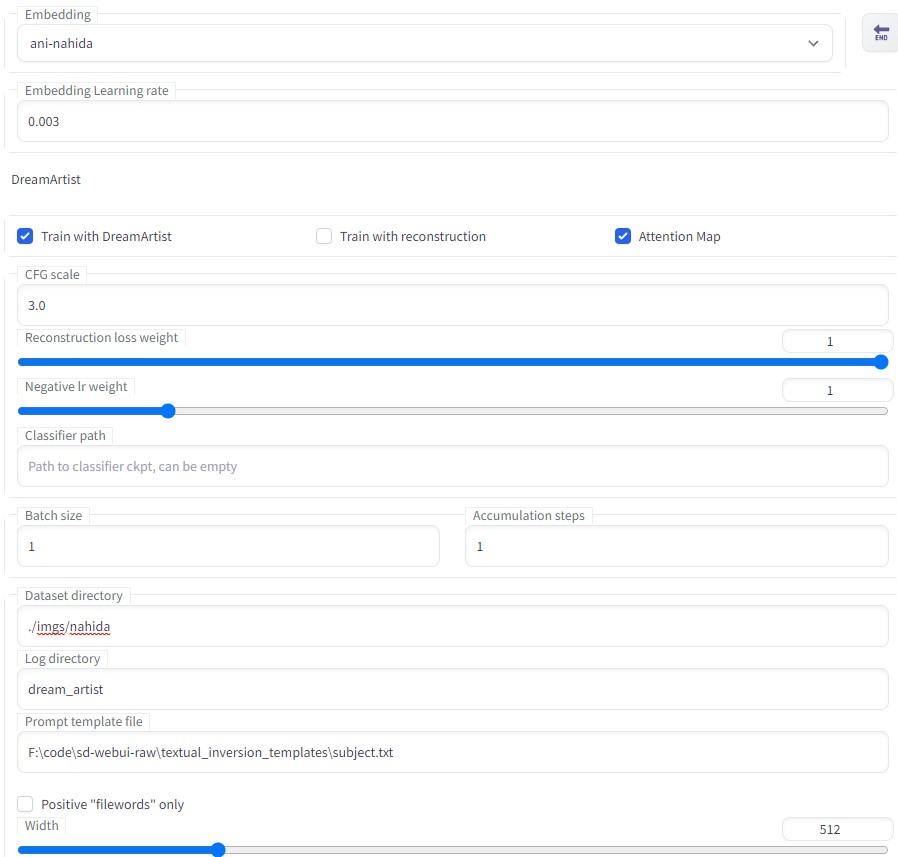

# DreamArtist (webui Eextension)
This repo is the official ***Stable-Diffusion-webui extension version** implementation of ***"DreamArtist: Towards Controllable One-Shot Text-to-Image Generation via Contrastive Prompt-Tuning"*** 
with [Stable-Diffusion-webui](https://github.com/AUTOMATIC1111/stable-diffusion-webui).

Regular version: [DreamArtist](https://github.com/7eu7d7/DreamArtist-stable-diffusion)

Everyone is an artist. Rome wasn't built in a day, but your artist dreams can be!

With just ***one*** training image DreamArtist learns the content and style in it, generating diverse high-quality images with high controllability.
Embeddings of DreamArtist can be easily combined with additional descriptions, as well as two learned embeddings.


# Setup and Running

Clone this repo to extension folder.
```bash
git clone https://github.com/7eu7d7/DreamArtist-sd-webui-extension.git extensions/DreamArtist
```

## Training

First create the positive and negative embeddings in ```DreamArtist Create Embedding``` Tab.


Then, select positive embedding and set the parameters and image folder path in the ```DreamArtist Train``` Tab to start training.
The corresponding negative embedding is loaded automatically.
If your VRAM is low or you want save time, you can uncheck the ```reconstruction```.



## Tested models (need ema version):
+ Stable Diffusion v1.5
+ animefull-latest
+ Anything v3.0

Embeddings can be transferred between different models of the same dataset.

## Pre-trained embeddings:


[Download](https://github.com/7eu7d7/DreamArtist-stable-diffusion/releases/tag/embeddings_v2)

| Name       | Model            | Image                                                              | embedding length (P,N) | iter  | lr     | cfg scale |
|------------|------------------|--------------------------------------------------------------------|------------------------|-------|--------|-----------|
| ani-nahida | animefull-latest |  | 3, 6                   | 8000  | 0.0025 | 3         |
| ani-cocomi | animefull-latest |  | 3, 6                   | 8000  | 0.0025 | 3         |
| ani-gura   | animefull-latest |    | 3, 6                   | 12000 | 0.0025 | 3         |
| ani-g      | animefull-latest |       | 3, 10                  | 1500  | 0.003  | 5         |
| asty-bk    | animefull-latest |      | 3, 6                   | 5000  | 0.003  | 3         |
| asty-gc    | animefull-latest |      | 3, 10                  | 1000  | 0.005  | 5         |
| real-dog   | sd v1.4          |     | 3, 3                   | 1000  | 0.005  | 5         |
| real-sship | sd v1.4          |   | 3, 3                   | 3000  | 0.003  | 5         |
| sty-cyber  | sd v1.4          |   | 3, 5                   | 15000 | 0.0025 | 5         |
| sty-shuimo | sd v1.4          |  | 3, 5                   | 15000 | 0.0025 | 5         |


# Style Clone


# Prompt Compositions


# Comparison on One-Shot Learning


# Other Results


